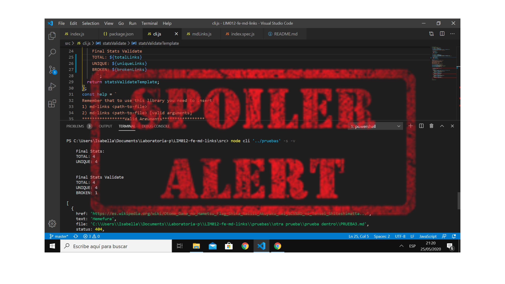

# Markdown Links 📄🔗


## About the project

Welcome to my first library! This the Markdown Links Library which will help you to extract
the links of all the markdown links of a path. It also give the information:
- Validate Links(OK, FAIL)
- Stats Links(total, unique, broken)
SPOILER ALERT!!


## Flow Chart 

- To create this library first we need to understand how we can built everything from the start, that's why we used:
   - Flow Chart.
   - Git hub projects.

### API Flow Chart


### CLI Flow Chart


## How to install mdLinks?

- Install this library with this command: `npm install IsabelaSanchez/LIM012-fe-md-links `

### API `mdLinks(path, opts)`

#### Example of how to use it:

```js
const mdLinks = require("md-links");

mdLinks("./some/example.md")
  .then(links => {
    // => [{ href, text, file }]
  })
  .catch(console.error);

mdLinks("./some/example.md", { validate: true })
  .then(links => {
    // => [{ href, text, file, status, ok }]
  })
  .catch(console.error);

mdLinks("./some/dir")
  .then(links => {
    // => [{ href, text, file }]
  })
  .catch(console.error);
```

### CLI (Command Line Interface - Interfaz de Línea de Comando)

``
Remember that to use this library you need to insert:
👉 md-links <path-to-file>
👉 md-links <path-to-file> [valid arguments]
*****************Valid Arguments*****************
⭐md-links <path-to-file> --validate   --stats
⭐md-links <path-to-file> --v   --s
⭐md-links <path-to-file> --V   --S
⭐md-links <path-to-file> --validate
⭐md-links <path-to-file> --stats
************************************************* ``

---

### Data Lovers learning goals
- [⭐] Entender la diferencia entre expression y statements.
- [⭐] Entender el uso de bucles (for | forEach).
- [⭐] Manipular arrays (filter | map | sort | reduce).
- [😅] Entender como funciona flexbox en CSS. *Este objetivo se queda para Red Social
- [⭐] Entender la diferencia entre tipos de datos atómicos y estructurados.
- [⭐] Utilizar linter para seguir buenas prácticas (ESLINT)

### Javascript
- [⭐] Uso de callbacks
- [😅] Consumo de Promesas
- [⭐] Creacion de Promesas
- [⭐] Modulos de Js
- [⭐] Recursión

### Node
- [⭐] Sistema de archivos
- [⭐] package.json
- [⭐] crear modules
- [⭐] Instalar y usar modules
- [⭐] npm scripts
- [⭐] CLI (Command Line Interface - Interfaz de Línea de Comando)

### Testing
- [⭐] Testeo de tus funciones
- [😅] Testeo asíncrono
- [ ] Uso de librerias de Mock
- [ ] Mocks manuales
- [ ] Testeo para multiples Sistemas Operativos

### Git y Github
- [⭐] Organización en Github

### Buenas prácticas de desarrollo
- [⭐] Modularización
- [⭐] Nomenclatura / Semántica
- [ ] Linting

***

## The End 	:shipit:
So this was mdLinks! I suffer a lot during this project but learn JS for real!

- Thank you to everyone who help and give the opportunity to learn and ask during this process. I know I would be a great Front End Developer!!

- **See you on Red Social!!


## Pistas / Tips

### FAQs

#### ¿Cómo hago para que mi módulo sea _instalable_ desde GitHub?

Para que el módulo sea instalable desde GitHub solo tiene que:

- Estar en un repo público de GitHub
- Contener un `package.json` válido

Con el comando `npm install githubname/reponame` podemos instalar directamente
desde GitHub. Ver [docs oficiales de `npm install` acá](https://docs.npmjs.com/cli/install).

Por ejemplo, el [`course-parser`](https://github.com/Laboratoria/course-parser)
que usamos para la currícula no está publicado en el registro público de NPM,
así que lo instalamos directamente desde GitHub con el comando `npm install
Laboratoria/course-parser`.

### Sugerencias de implementación

La implementación de este proyecto tiene varias partes: leer del sistema de
archivos, recibir argumentos a través de la línea de comando, analizar texto,
hacer consultas HTTP, ... y todas estas cosas pueden enfocarse de muchas formas,
tanto usando librerías como implementando en VanillaJS.

Por poner un ejemplo, el _parseado_ (análisis) del markdown para extraer los
links podría plantearse de las siguientes maneras (todas válidas):

- Usando un _módulo_ como [markdown-it](https://github.com/markdown-it/markdown-it),
  que nos devuelve un arreglo de _tokens_ que podemos recorrer para identificar
  los links.
- Siguiendo otro camino completamente, podríamos usar
  [expresiones regulares (`RegExp`)](https://developer.mozilla.org/es/docs/Web/JavaScript/Guide/Regular_Expressions).
- También podríamos usar una combinación de varios _módulos_ (podría ser válido
  transformar el markdown a HTML usando algo como [marked](https://github.com/markedjs/marked)
  y de ahí extraer los link con una librería de DOM como [JSDOM](https://github.com/jsdom/jsdom)
  o [Cheerio](https://github.com/cheeriojs/cheerio) entre otras).
- Usando un _custom renderer_ de [marked](https://github.com/markedjs/marked)
  (`new marked.Renderer()`).

No dudes en consultar a tus compañeras, coaches y/o el [foro de la comunidad](http://community.laboratoria.la/c/js)
si tienes dudas existenciales con respecto a estas decisiones. No existe una
"única" manera correcta :wink:

### Tutoriales / NodeSchool workshoppers

- [learnyounode](https://github.com/workshopper/learnyounode)
- [how-to-npm](https://github.com/workshopper/how-to-npm)
- [promise-it-wont-hurt](https://github.com/stevekane/promise-it-wont-hurt)

### Otros recursos

- [Acerca de Node.js - Documentación oficial](https://nodejs.org/es/about/)
- [Node.js file system - Documentación oficial](https://nodejs.org/api/fs.html)
- [Node.js http.get - Documentación oficial](https://nodejs.org/api/http.html#http_http_get_options_callback)
- [Node.js - Wikipedia](https://es.wikipedia.org/wiki/Node.js)
- [What exactly is Node.js? - freeCodeCamp](https://medium.freecodecamp.org/what-exactly-is-node-js-ae36e97449f5)
- [¿Qué es Node.js y para qué sirve? - drauta.com](https://www.drauta.com/que-es-nodejs-y-para-que-sirve)
- [¿Qué es Nodejs? Javascript en el Servidor - Fazt en YouTube](https://www.youtube.com/watch?v=WgSc1nv_4Gw)
- [¿Simplemente qué es Node.js? - IBM Developer Works, 2011](https://www.ibm.com/developerworks/ssa/opensource/library/os-nodejs/index.html)
- [Node.js y npm](https://www.genbeta.com/desarrollo/node-js-y-npm)
- [Módulos, librerías, paquetes, frameworks... ¿cuál es la diferencia?](http://community.laboratoria.la/t/modulos-librerias-paquetes-frameworks-cual-es-la-diferencia/175)
- [Asíncronía en js](https://carlosazaustre.com/manejando-la-asincronia-en-javascript/)
- [NPM](https://docs.npmjs.com/getting-started/what-is-npm)
- [Publicar packpage](https://docs.npmjs.com/getting-started/publishing-npm-packages)
- [Crear módulos en Node.js](https://docs.npmjs.com/getting-started/publishing-npm-packages)
- [Leer un archivo](https://nodejs.org/api/fs.html#fs_fs_readfile_path_options_callback)
- [Leer un directorio](https://nodejs.org/api/fs.html#fs_fs_readdir_path_options_callback)
- [Path](https://nodejs.org/api/path.html)
- [Linea de comando CLI](https://medium.com/netscape/a-guide-to-create-a-nodejs-command-line-package-c2166ad0452e)
- [Promise](https://javascript.info/promise-basics)
- [Comprendiendo Promesas en Js](https://hackernoon.com/understanding-promises-in-javascript-13d99df067c1)
- [Pill de recursión - video](https://www.youtube.com/watch?v=lPPgY3HLlhQ&t=916s)
- [Pill de recursión - repositorio](https://github.com/merunga/pildora-recursion)

